# Financial Fraud Detection

This project aims to use machine learning techniques to detect fraudulent financial transactions. Using a synthetic dataset of bank transactions, the goal is to create a model to accurately recognize fraud and also be able to predict whether a transaction is fraudulent or not. 

## Project Overview
This project used the Logistic Regression and Naive Bayes classifiers to build a fraud detection model. The dataset was cleaned and preprocessed, SMOTE was applied for class balancing and the models were evaluated by Classification Report (accuracy, precision, recall), F1 Score and the Receiver Operating Characteristic (ROC) Curve. 

## Dataset
This dataset contained a mix of discrete and continuous variables:
* step: a unit of time that represents hours in the dataset (e.g. the timestamp of the transaction)
* type: the type of transaction
* amount: the amount of money transferred
* NameOrig: the origin account name
* OldBalanceOrg: the origin accounts balance before the transaction
* NewBalanceOrig: the origin accounts balance after the transaction
* NameDest: the destination account name
* OldbalanceDest: the destination accounts balance before the transaction
* NewbalanceDest: the destination accounts balance after the transaction
* isFlaggedFraud: a "naive" model that simply flags a transaction as fraudulent if it is greaer than 200,000 (this current is not USD)
* isFraud: was this simulated transaction actually fraudulent? In this case, we consider "fraud" to be a malicious transaction that aimed to transfer funds out of a victim's bank account before the account owner could secure their information.

# Part I: Exploratory Data Analyses: Univariate, Bivariate & Multivariate
## Key Insights: 
* Imbalanced Dataset: the dataset is imbalanced. Non-fraudulent transactions easily outnumbered fraudulent transactions.
* Transactions with highest fraud: Cash_Out and Transfer were the types with the most fraud. 
* Indicators of fraud: features like amount and balance changes were important indicators of fraud

# Univariate Analysis
## Key Insights:
* In this dataset, the majority of transactions were not fraudulent. Approximately 0.1% of transactions were fraudulent. 

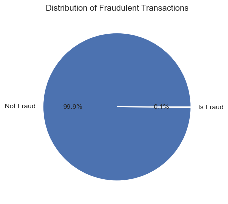

* The transactions that were "isFlaggedFraud" were miniscule, and did not warrant a long look. 

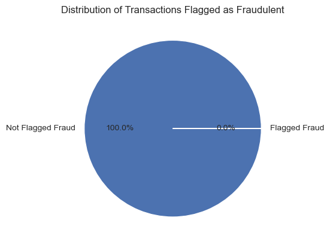

* Most fraudulent activity was seen in the Cash_Out and Transfer types.

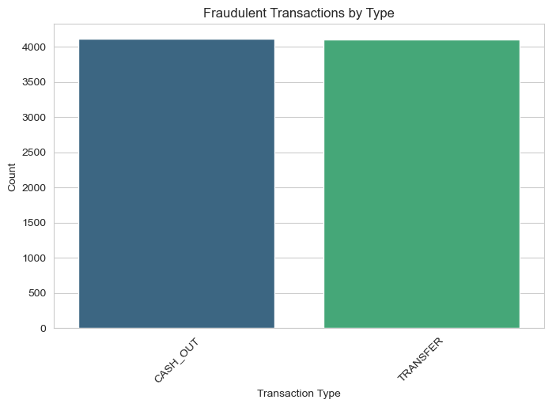    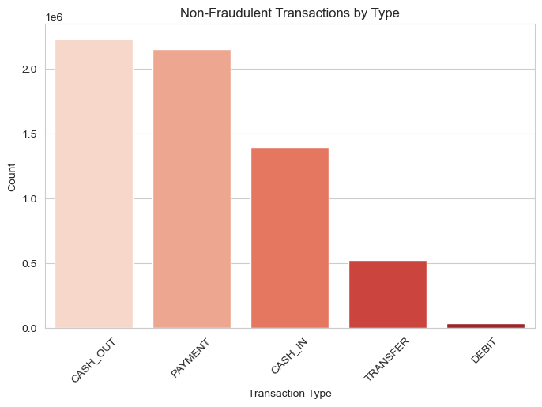

* When analyzing distribution of transaction amounts, I found that it was highly skewed. There was a large number of small transactions and a few very large ones. I applied Log Transformation on "amount" to reduce the impact of extreme values. 

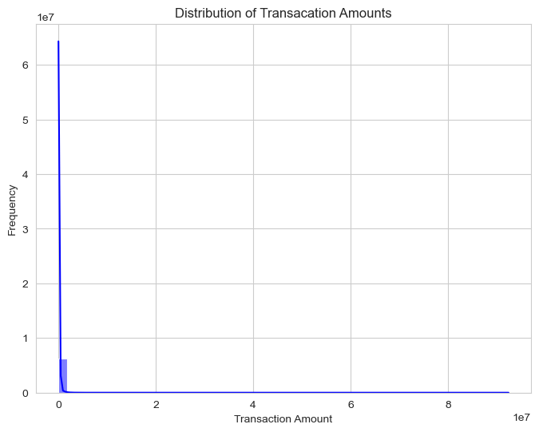 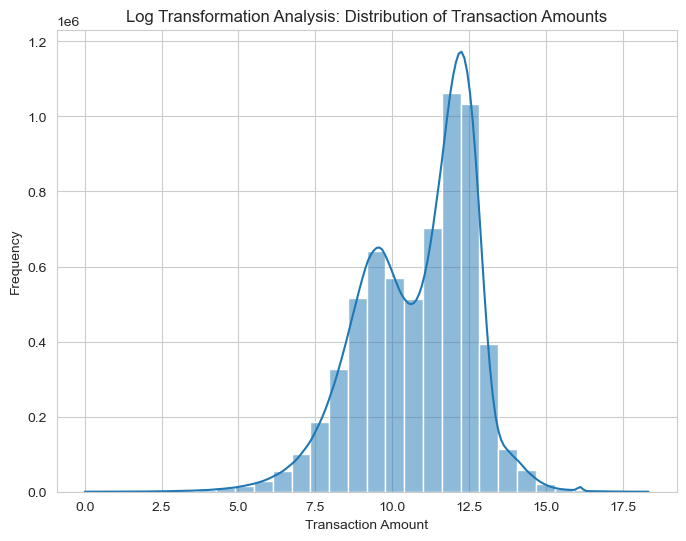

# Bivariate Analysis
## Key Insights:
* Fraudulent transactions had different distribution patterns, compared to non-fraudulent ones
* Fraudulent transactions had higher amounts, compared to legitimate transactions
* Transfer and Cash_Out transactions had the highest incidents of fraud, whereas Payment and Debit had low rates of fraud. 

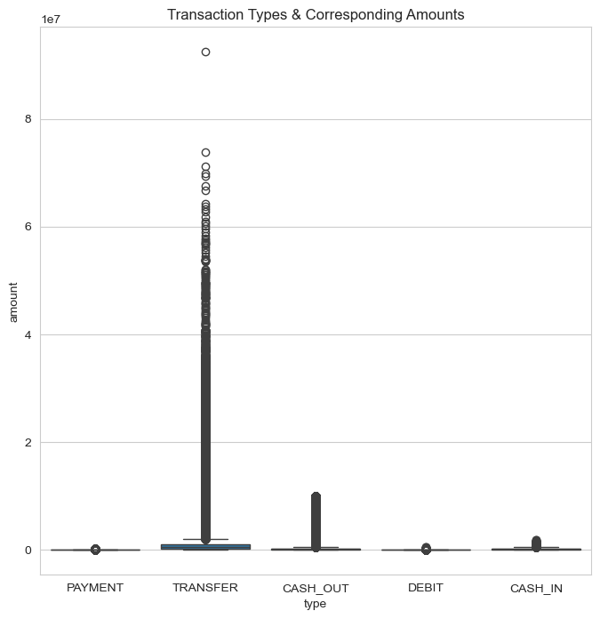

* A violin plot was used to illustrate fraudulent vs. non-fraudulent transactions by amount. The model shows that most legitimate transactions probably involved small amounts. Fraudulent transactions,on the other hand, seems to have higher amounts than non-fraud ones. The presence of outliers might indicate that large transactions were targets for fraud. I did not remove the outliers, for this reason. 

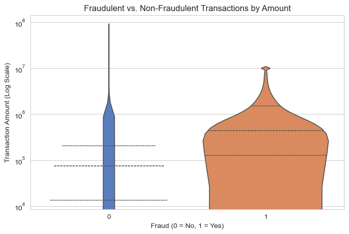

# Multivariate Analysis
## Key Insights:
* Fraudulent transactions often had a zero or unchanged balance after the transaction, which seemed unusual, in my opinion. 
* There seemed to be a high correlation between oldbalance Org, newbalanceOrig, amount and transaction type, in detecting fraud

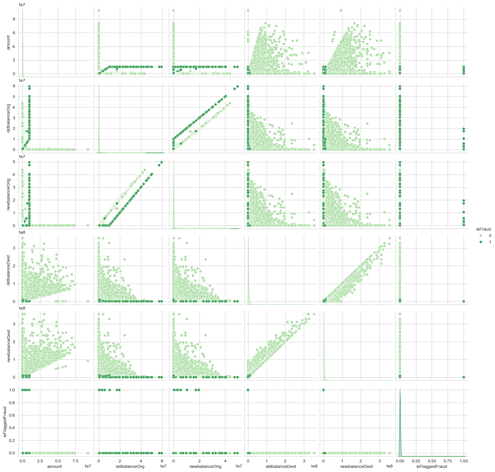

# Part II: Data Cleaning, Wrangling & Pre-Processing
## Key Insights: 
* There were no missing values. Duplicates were found and dropped. 
* The following columns were dropped: step, nameOrig, nameDest & isFlaggedFraud. These columns were not as interesting to me as the others, or they had minimal information that did not seem relevant to what I wanted my models to train on. As I was performing EDA on various columns, I decided that I was not really interested in the "step" data. Analyzing "isFraud" clearly showed that most fraudulent activities were occuring in two specific transaction types: transfers and cash_out. The timeframe of when the fraud occurred was not important to me. I was also not interested in the name of the origin account, or the name of the destination account. What mattered most was the type of transactions where fraud was prevalent, and also the amount. 
* StandardScaler was applied to numerical columns, to normalize distributions and improve model performance. 
* One-hot encoder was applied to "type", converting it from categorical to numerical. 
* Dummy variables were created for all transaction types

# Part III: Models
### Logistic Regression and Naive Bayes were the two classifiers used. 

### Train-Test-Split
* The purpose of Train-Test-Split is to divide the dataset into a training set and a testing set. The training set is used to train the model. The testing set is used to test the model's performance after it has been trained. 
* The "isFraud" column was chosen as the target (i.e. the y value). This column indicates whether a transaction is fraud or not. 
* 20% of the data was used for testing (test_size=0.2), and the remaining 80% was used for training. 
* stratify=y is used to ensure that "fraud vs. non-fraud" distribution is preserved in the testing and training sets. 

### SMOTE (Synthetic Minority Over-sampling Technique)
* smote = SMOTE(random_state=42)
X_train_res, y_train_res = smote.fit_resample(X_train, y_train)

* The purpose of SMOTE is to balance an imbalanced dataset by creating synthetic samples of the minority class. This dataset was severely imbalanced with non-fraudulent transactions over-powering fraudulent transactions (aka "the minority class"). 
* SMOTE was applied once train-test-split was completed. 
* "smote.fit_resample" portion was used to balance the dataset so that there was an equal amount of fraudulent and non-fraudulent transactions in the training set. I felt that this was beneficial to the model, allowing it to consider both conditions equally. 

## Logistic Regression Classifier
### Key Insights: 
* The F1 Score was 0.0435. This was a low score. It's an indication that the model is not performing well, especially in recognizing fraudulent transactions. 
* This model had a 95% recall score, which means that it correctly identified many fraudulent transactions. 
* The precision score was low (0.0223), indicating that the model was susceptible to incorrectly predicting fraud. 

* Classification Report: Logistic Regression: 
              precision    recall  f1-score   support

           0       1.00      0.95      0.97   1270881
           1       0.02      0.96      0.04      1643

    accuracy                           0.95   1272524
   macro avg       0.51      0.95      0.51   1272524
weighted avg       1.00      0.95      0.97   1272524

* Confusion Matrix parameters: 
>     True Negatives (TN): non-fraudulent transactions classified as not fraud
>     False Positives (FP): non-fraudulent transacations incorrectly classified as fraud
>     False Negatives (FN): fraudulent transactions incorrectly classified as not fraud
>     True Positive (TP): fraudulent transactions correctly classfied as fraud

* The Confusion Matrix did a good job of showing non-fraudulent transactions, and it was also successful with identifying fraudulent transactions. 
* Some areas that need improvement: it incorrectly flagged a lot of non-fraudulent transactions as fraud. It also labeled some fraudulent transactions as non-fraud. 

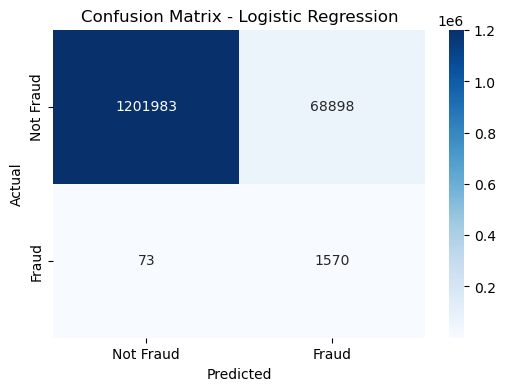

## Naive Bayes Classifier
### Key Insights
* The F1 Score was 0.0039. This was a low score. It's an indication that the model was struggling to balance the dataset. It's also an indicator that the model was not successful in determining fraudulent transactions. 
* This model had a 99.94% recall and 0.2% precision score. The precision score indicates that the model might have a high tendency to label non-fraudulent transaction as fraud. The recall score, however, tells that the model was exceptional at detecting fraud correctly. 

* Classification Report: Naive Bayes: 
              precision    recall  f1-score   support

           0       1.00      0.35      0.52   1270881
           1       0.00      1.00      0.00      1643

    accuracy                           0.35   1272524
   macro avg       0.50      0.68      0.26   1272524
weighted avg       1.00      0.35      0.52   1272524

* The Confusion Matrix shows that the Naive Bayes model leans toward correctly recogning non-fraudulent transactions. Even though it only predicted a small amount of fraudulent transactions, it did so correctly. 

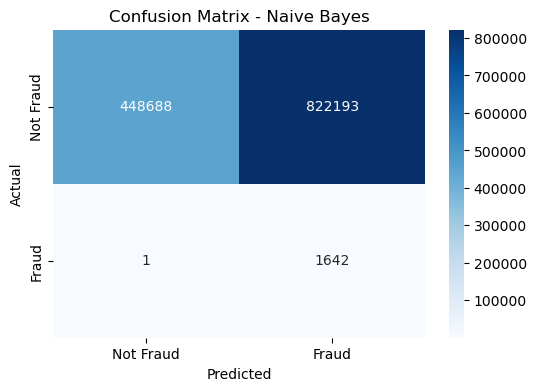

## Summary
The Logistic Regression model seems to be better suited to this particular dataset because of its higher F1 Score and high recall. The Logistic Regression model shows that it can balance precision and recall, which are both important for detecting fraud. 

If I were to continue with this project outside of this fellowship, I would implement hyperparameters to see if that would achieve better results in both models. I would also explore KNN and try again with SVM. The SVM classifier was challenging to work with. The first run of code was still going after 2.5 days. It felt like an exercise in futility, but I was still pained to let it go. 

